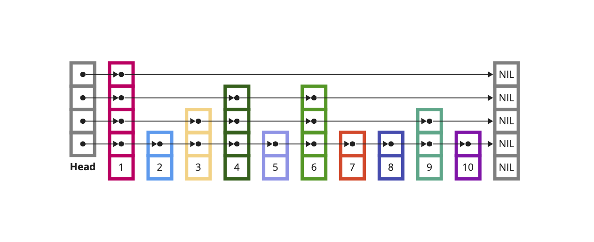
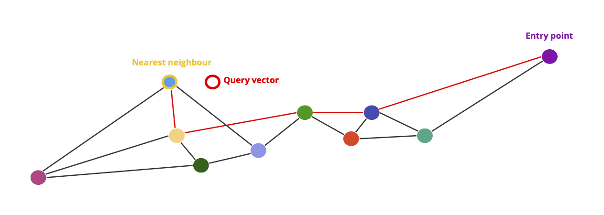
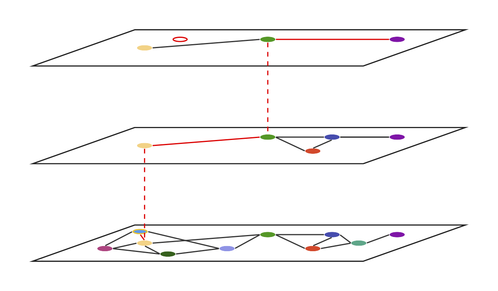

# Hierarchical Navigable Small Worlds

This repository contains a Python implementation of the *Hierarchical Navigable Small Worlds* (HNSW) algorithm for Approximate Nearest Neighbours (ANN) search [1]. HNSW is recognised for its efficiency and high recall rate, making it a preferred choice for vector search tasks in high-dimensional spaces.

### Usage
#### Initialising the graph
In HNSW, the vectors are stored in a layered proximity graph where each vector is linked to other nearby vectors. To perform a vector similarity search, we first initialise the graph:
```
from hnsw import HNSW

hnsw = HNSW(M=32, M_0=64, m_L=4)
```
- `M` is the number of neighbours we add to each vector on insertion
- `M_0` is the number of neighbours of each vector in the lowest layer of the graph
- `m_L` is the non-zero 'level multiplier' that normalises the exponentially decaying probability distribution that determines which layer a given vector should be inserted in

All arguments are optional and have standard defaults.

#### Populating the graph
We can populate the graph with standard Python lists representing our vectors (ensure that they all have the same dimension):
```
vector = [1.253, 9.153, 4.752, 3.364]
hnsw.add(vector)
```
#### Vector search
To find the nearest neighbour in our graph to the input vector:
```
input_vector = [4.264, 2.991, 9.001, 2.188]
nearest_neighbour = hnsw.search(input_vector)
```

### Explanation of the Algorithm

The HNSW algorithm leverages a layered graph structure where each node is connected to others based on a proximity metric such as Euclidean distance or cosine similarity. It enhances the Navigable Small World (NSW) graph model by incorporating elements of the Probability Skip List.

#### Probability Skip List
The concept of the Probability Skip List was introduced in 1990 by William Pugh [2]. This data structure enhances the traditional linked list by incorporating randomised layers where each successive layer has increasingly longer connections, thereby boosting search performance to $O(log \space n)$. To search within this structure, one begins at the topmost layer, utilising the hierarchical nature to bypass extensive portions of the list efficiently. Upon encountering a node whose key is greater than the search key, or when a node has no subsequent nodes, the search descends to the next layer. This process repeats until the closest node is located.




#### Navigable Small World Graphs
Vector search using Navigable Small World (NSW) graphs employs a proximity graph enhanced with both long-range and short-range links, reducing search times to polylogarithmic complexity, $O(log^k \space n)$. In these graphs, each vertex, or node, maintains a list of connections known as 'friends', forming the graph's structure. This 'friend list' enables the graph's navigable feature, facilitating efficient search routes. The search process employs greedy routing, starting from low-degree vertices—those with fewer connections—and advancing towards high-degree vertices. This approach allows the algorithm to quickly traverse the graph's sparse regions before honing in on denser areas where the nearest neighbor is more likely to be found, ensuring efficient navigation and search within the graph.



#### Hierarchical Navigable Small Worlds
HNSW combines navigable small worlds with the hierarchical probabilistic layers from Pugh's probabilistic list structure. In HNSW, links are separated across different layers where the top layers have the longest links, and the lower layers have increasingly shorter links. During search, we begin in the top layer, then, similarly to probabilitiy linked lists, we traverse deeper down the layers as we progress through the search. The end result is that we are able to perform an extremely efficient nearest neighbour search.




## Reference

[1] Y. Malkov, D. Yashunin, [Efficient and robust approximate nearest neighbor search using Hierarchical Navigable Small World graphs](https://arxiv.org/pdf/1603.09320.pdf) (2016), IEEE Transactions on Pattern Analysis and Machine Intelligence

[2] W. Pugh, [Skip lists: a probabilistic alternative to balanced trees](https://15721.courses.cs.cmu.edu/spring2018/papers/08-oltpindexes1/pugh-skiplists-cacm1990.pdf) (1990), Communications of the ACM, vol. 33, no.6, pp. 668-676
